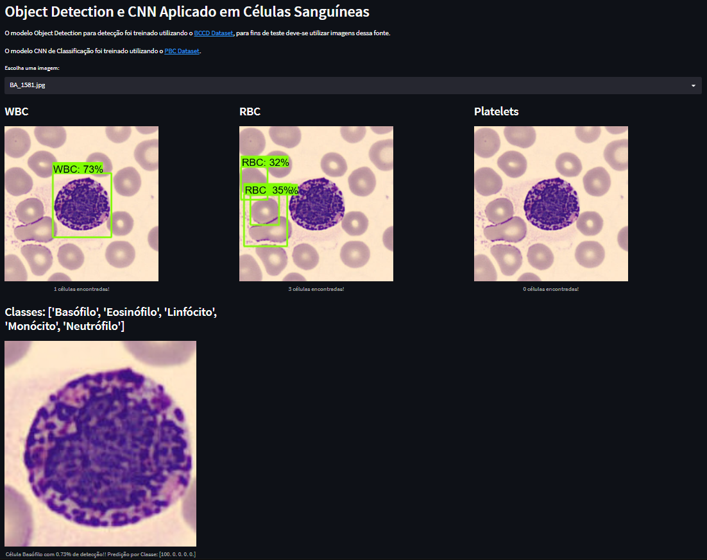

# White Blood Cell Classification

Treinamento de um modelo de Rede Neural Artifical Convolucional para classificação de células brancas em imagens de amostra de sangue através do uso do Sequencial, modelo do Tensorflow e Keras.
O modelo permite classficar as células brancas em seus 5 principais tipos:
* Basófilos
* Eosinófilos
* Linfócitos
* Monócitos
* Neutrófilos

Para treinamento do modelo foi utilizado a base de dados públicada em [Acevedo - PBC](https://data.mendeley.com/datasets/snkd93bnjr/1).

Com um total de 17.092 imagens relacionadas a células brancas, todas  coletadas de pacientes sem patologias sanguíneas, por profissionais do Hospital das Clínicas de Barcelona utilizando equipamento especializado. O dataset já é rotulado em oito grupos: Neutrófilos, Eosinófilos, Basófilos, Linfócitos, Monócitos, Eritroblastos, Plaquetas e Granulócitos Imaturos. Cada rótulos corresponde a uma pasta que contém as imagens do tipo.
O tamanho de cada imagem é de 360px x 363px, colorida e com formato JPG. Sendo o primeiro acervo público com grande quantidade de imagens de alta qualidade referentes a células sanguíneas

## Aplicando Deep Learning para classificação de Células em Amostras De Sangue

O projeto foi desenvolvido como requisito para obtenção do grau de Bacharel em  Ciência da Computação da Universidade Federal da Fronteira Sul, campus Chapecó.
## Prévia

